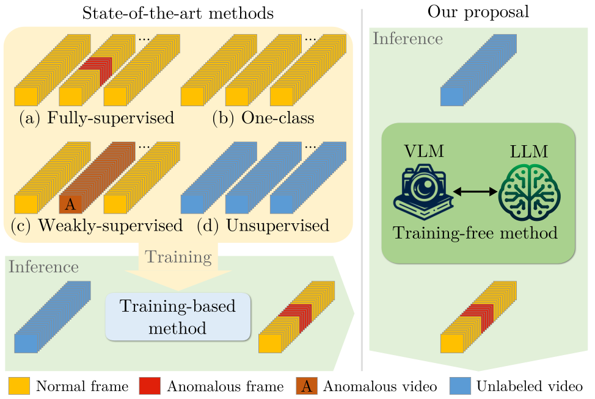

<div align="center">

[](https://arxiv.org/abs/2404.01014)
[](https://lucazanella.github.io/lavad/)

# Harnessing Large Language Models for Training-free Video Anomaly Detection

[Luca Zanella](https://lucazanella.github.io/), [Willi Menapace](https://www.willimenapace.com/), [Massimiliano Mancini](https://mancinimassimiliano.github.io/), [Yiming Wang](https://www.yimingwang.it/), [Elisa Ricci](https://eliricci.eu/) <br>

</div>

<p align="center">
  
</p>
<br>

> **Abstract:** *Video anomaly detection (VAD) aims to temporally locate abnormal events in a video. Existing works mostly rely on training deep models to learn the distribution of normality with either video-level supervision, one-class supervision, or in an unsupervised setting.  Training-based methods are prone to be domain-specific, thus being costly for practical deployment as any domain change will involve data collection and model training. In this paper, we radically depart from previous efforts and propose **LA**nguage-based **VAD** (LAVAD), a method tackling VAD in a novel, *training-free* paradigm, exploiting the capabilities of pre-trained large language models (LLMs) and existing vision-language models (VLMs). We leverage VLM-based captioning models to generate textual descriptions for each frame of any test video. With the textual scene description, we then devise a prompting mechanism to unlock the capability of LLMs in terms of temporal aggregation and anomaly score estimation, turning LLMs into an effective video anomaly detector. We further leverage modality-aligned VLMs and propose effective techniques based on cross-modal similarity for cleaning noisy captions and refining the LLM-based anomaly scores. We evaluate LAVAD on two large datasets featuring real-world surveillance scenarios (UCF-Crime and XD-Violence), showing that it outperforms both unsupervised and one-class methods without requiring any training or data collection.*

# Setup

We recommend the use of a Linux machine with CUDA compatible GPUs. We used 2x NVIDIA A100 GPUs with 64GB. We provide both a Conda environment and a Dockerfile to configure the required libraries.

Clone the repo with:

```bash
git clone https://github.com/lucazanella/lavad.git
cd lavad
```

## Conda

The environment can be installed and activated with:

```bash
conda create --name lavad python=3.10
conda activate lavad
pip install -r requirements.txt
```

## Docker

Alternatively, you can use the Dockerfile to build a docker image with the following command:

```bash
docker build -t lavad -f docker/Dockerfile .
```

Run the Docker container by mounting the project root to `/usr/src/app` and the folder containing your datasets to `/usr/src/datasets` with the following command:

```bash
docker run --shm-size 64gb --gpus '"device=0,1"' --rm -it -v $(pwd):/usr/src/app -v /path/to/directory/datasets:/usr/src/datasets lavad /bin/bash
```

# Data

Please download the data, including captions, temporal summaries, indexes with their textual embeddings, and scores for the UCF-Crime and XD-Violence datasets, from the links below:

| Dataset     | Link                                                                                               |
| ----------- | -------------------------------------------------------------------------------------------------- |
| UCF-Crime   | [Google Drive](https://drive.google.com/file/d/1_7juCgOoWjQruyH3S8_FBqajuRaORmnV/view?usp=sharing) |
| XD-Violence | [Google Drive](https://drive.google.com/file/d/1yzDP1lVwPlA_BS2N5Byr1PcaazBklfkI/view?usp=sharing) |

and place them in the `/path/to/directory/datasets` folder. The code works with pre-extracted frames, which are not provided within the zipped files. You can download the videos from the official websites ([UCF-Crime](https://www.crcv.ucf.edu/projects/real-world/) and [XD-Violence](https://roc-ng.github.io/XD-Violence/)) and extract the frames yourself using a script similar to `scripts/00_extract_frames.sh`. Please note that you need to change the paths within the files included in the `annotations` folder of each dataset accordingly.

# Pretrained models

We employ BLIP-2 as the captioning module, Llama 2 as our large language model (LLM) module, and multimodal encoders provided by ImageBind. While the download of BLIP-2 and ImageBind models should start automatically, you need to download Llama 2. Please download `llama-2-13b-chat` from the official repository by following the [download instructions](https://github.com/meta-llama/llama#download) and place the model and the tokenizer in `libs/llama`.

# Evaluation

**Are you interested in running LAVAD on UCF-Crime and XD-Violence?**

The slurm scripts used to generate captions, temporal summaries, indexes with their textual embeddings, and scores for UCF-Crime can be found in `slurm/ucf_crime`, while those used for XD-Violence can be found in `slurm/xd_violence`. The scripts are numbered for ease of execution. Each script requires completion of the previous steps before execution.

| Step | Description                                                   | Script                                        |
| ---- | ------------------------------------------------------------- | --------------------------------------------- |
| 1    | Generate textual descriptions of video frames                 | `slurm/<dataset>/01_caption.sh`               |
| 2    | Create index with textual embeddings of frame captions        | `slurm/<dataset>/02_create_index.sh`          |
| 3    | Build clean set of captions                                   | `slurm/<dataset>/03_clean_captions.sh`        |
| 4    | Create temporal summaries and estimate initial anomaly scores | `slurm/<dataset>/04_query_llm.sh`             |
| 5    | Create index with textual embeddings of temporal summaries    | `slurm/<dataset>/05_create_summary_index.sh`  |
| 6    | Refine anomaly scores                                         | `slurm/<dataset>/06_refine_anomaly_scores.sh` |
| 7    | Compute metrics                                               | `slurm/<dataset>/07_eval.sh`                  |

where you need to replace `<dataset>` with either `ucf_crime` or `xd_violence`.

## Custom Inference

**Are you interested in running LAVAD on your videos?**

You can save the videos in a `videos` folder and run the scripts in `scripts` one at a time by updating the variables of interest (e.g., `dataset_dir` and `fps`). Please note that you first need to extract the frames using `scripts/00_extract_frames.sh`.

# Citation

Please consider citing our paper in your publications if the project helps your research.

```
@inproceedings{zanella2024harnessing,
  title={Harnessing Large Language Models for Training-free Video Anomaly Detection},
  author={Zanella, Luca and Menapace, Willi and Mancini, Massimiliano and Wang, Yiming and Ricci, Elisa},
  booktitle={Proceedings of the IEEE/CVF Conference on Computer Vision and Pattern Recognition},
  pages={18527--18536},
  year={2024}
}
```
